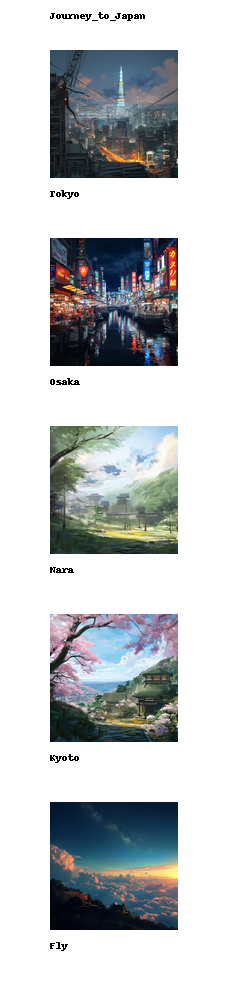

# TravelToon

This project allows you to transform your travel photos or text descriptions into beautiful, comic-style images.

## How to Use:
- Place your photos in the ./source folder.
- Download three models from hf(black-forest-labs/FLUX.1-dev, InstantX/FLUX.1-dev-Controlnet-Canny, XLabs-AI/flux-lora-collection) and configure their paths in the config file.
- In the config file, provide your travel text descriptions or photo names.
- Run generate.py and find your comic-style travel diary in the ./result folder!

## Demo Result

| Raw                   | Sketch                | TravelToon V1 (Better Content) | TravelToon V2 (Better alignment to Sketch) |
|-----------------------|-----------------------|-------------------------------|--------------------------------------------|
|  |  |  |  |

